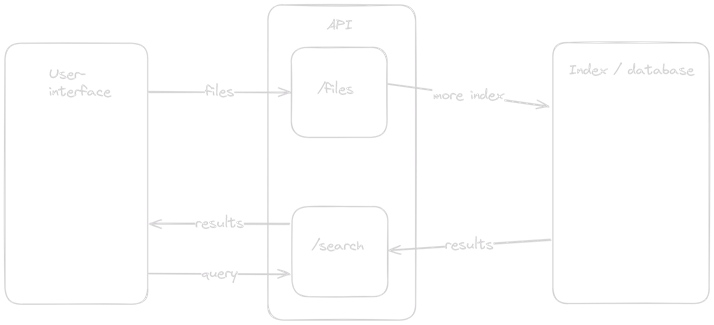

# Search Engine

This is a simple search engine built using Spring Boot. It indexes text files and allows searching for words within those files.

## Project structure

This project tries to follow the MVC pattern

```src/main/java/com/search/engine``` contains the back-end code

```src/main/resources/static/index.html``` contains the front-end code

## Getting started 

### Prerequisites for running:

- TODO

### Pre-requisites for building:

- Java 17
- Maven

### Running tests:

```bash
mvn test
```

or

```bash
./mvnw test
```

### Running the application:

```bash
mvn spring-boot:run
```

or

```bash
./mvnw spring-boot:run
```

### Using the application:

- Open a browser and navigate to ```http://localhost:8000```
- Click on the "Choose File" button and select a text file to upload
- Enter a word to search for in the search bar and click on the "Search" button
- The search results will be displayed below the search bar

## Technologies used

- Spring Boot (for the back-end)
- SQLite (for storing the index)
- Lombok (for reducing boilerplate code)
- Maven (for building the project)
- HTML, CSS, JavaScript (for the front-end)

## Indexing strategy

The search engine indexes the text files by splitting the text into words and storing the words in a SQLite database along with the file name and occurrence amount of the word in the file. This allows for quick searching of words within the files. A stop words list is used to filter out common words that do not add value to the search results. In the case that a word is not found in the index, the search engine will return the closest matching word based on the Levenshtein distance. A significant weakness of the indexing strategy is that positional data is not stored, so word sequences cannot be searched for. Multi word search is supported by searching for each word individually and then combining the results.

Index structure:

```
{
    "someword": {
        "somefile.txt": 3,
        "otherfile.txt": 1
    },
    "anotherword": {
        "somefile.txt": 1
    }
}
```

## Architecture diagram



## TODO

 - ~~Restructure index~~
 - ~~Use SQLite instead of JSON~~
 - ~~Filter stop words~~
 - ~~Levenshtein distance~~
 - ~~Multi word search~~
 - ~~File upload~~
 - UI improvements
 - Containerization
 - Performance testing
 - Performance improving
 - Multithreading